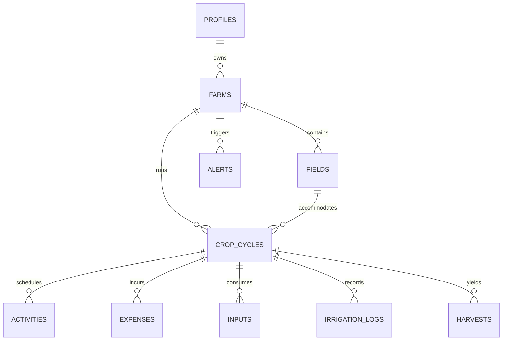

# FarmPilot Architecture & Technical Design

## System Architecture

```
┌─────────────────────────────────────────────────────────────┐
│                       Web Browser                           │
│  React 19 + TypeScript + Tailwind CSS (Clean Light Theme)  │
└──────────────────────────────┬──────────────────────────────┘
                               │
               HTTP / REST & WebSocket / Realtime
                               │
                               ▼
┌─────────────────────────────────────────────────────────────┐
│                    Supabase Backend                         │
│  ├── GoTrue Auth (JWT Authentication)                       │
│  ├── PostgREST API (Auto-generated from PostgreSQL Schema)  │
│  ├── PostgreSQL 15 Database (12 Tables with Constraints)     │
│  ├── Row Level Security (RLS) Isolation                     │
│  └── Stored Procedures & Health Score Calculation Engine   │
└─────────────────────────────────────────────────────────────┘
                               │
                      (Fallback Layer)
                               ▼
┌─────────────────────────────────────────────────────────────┐
│                Local Reactive Demo Store                    │
│  LocalStorage Engine + MockDataStore for 100% Offline Demo  │
└─────────────────────────────────────────────────────────────┘
```

## Data Schema & Relationships



## Key Architectural Decisions

1. **Hybrid Backend Engine**:
   When `VITE_SUPABASE_URL` is set, the application operates against Supabase with PostgreSQL transactions and Row Level Security. When unconfigured (e.g., during initial judge evaluation), the application automatically falls back to an in-memory/localStorage store pre-seeded with Green Valley Farm data, ensuring zero setup friction.

2. **Decoupled Intelligence Service**:
   Business intelligence (Farm Health Score, profitability projection, priority queue generation, explainable recommendations) is encapsulated in pure, functional TypeScript functions in `src/services/intelligenceService.ts`. This allows instant client-side recalculation whenever any task, expense, or input is modified, delivering sub-16ms UI responsiveness.

3. **Multi-dimensional Farm Health Score**:
   Rather than simple binary status tracking, Farm Health Score blends 4 key operational dimensions:
   - **35% Task Completion**: Core operational volume.
   - **25% Schedule Adherence**: Time-critical agricultural compliance.
   - **20% Cost Efficiency**: Budget discipline against planned allocations.
   - **20% Crop Progress**: Biological stage progression.
